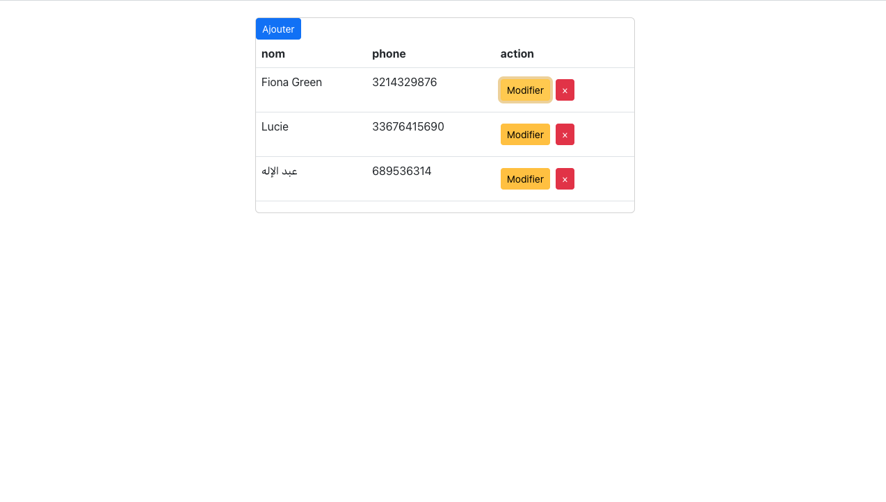
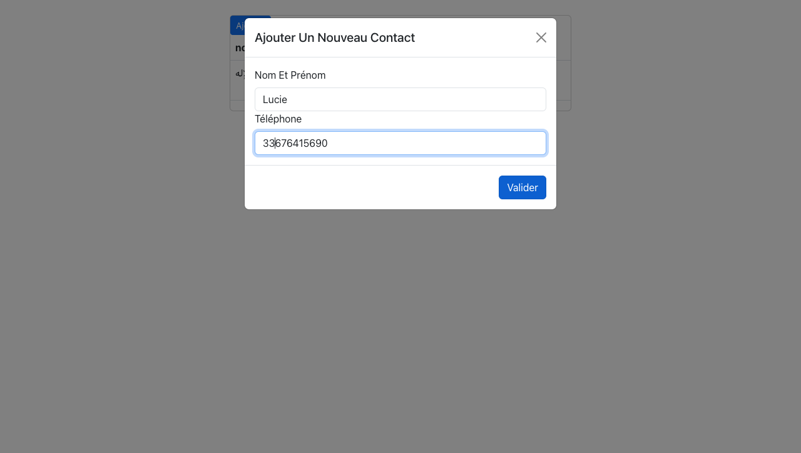
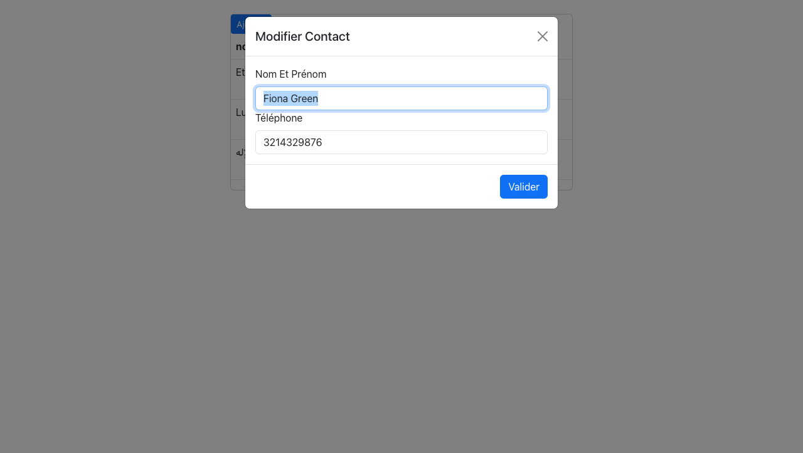
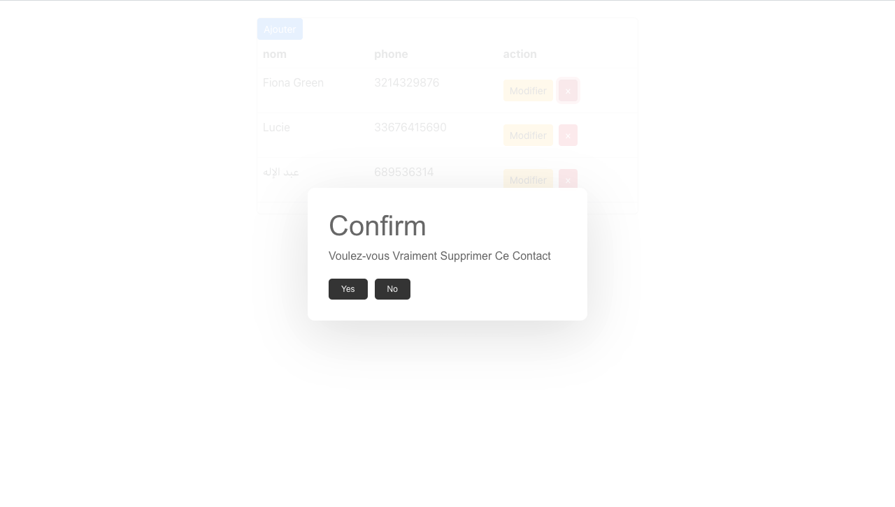

# Contacts-app

This ` web ` application is designed to allow you to manage _**Your Contacts**_. 

## Features

- [x] Add new contacts 
- [x] View existing contacts
- [x] Delete Contacts. 
- [x] Edit existing contacts. 
- [x] All your changes are in real time. 

## Technologies used

- React
- JavaScript
- HTML
- CSS

## Screenshots

### Contact list



### Add contact



### Edit contact



### Delete contact



## Installation

1. Clone this repository : 
- [x] ``` git clone https://github.com/Abdelilah-Falih/Contacts-app.git ```


2. Install dependencies
- [x] ``` npm install ```


3. Start the application
- [x] ``` npm start ```


## Contributing

Contributions are welcome! Please feel free to submit a pull request.

## License
This project is licensed under the MIT License - see the [LICENSE.md](LICENSE.txt) file for details.
